## Computer Networks

- A group of computers connected for the purpose of sharing their resources is called computer networks.
- First Computer Network:ARPANET
- ARPANET:Advanced Research Project Agency Network

## Characteristics

- Resource Sharing
- Communication Speed
- Backup
- Scalability
- Reliability
- S/W & H/W sharing
- Security

## Network Devices

- Modem
- HUB
- Switch
- Gateway
- BRIDEGE
- Router
- Repeater

## Network Types

- PAN : Personal Area Network

  - Range: <10 M
  - Used for personal use
  - Home
    ```mermaid
    graph LR;
    A[Bluetooth]-->B[Computer]
    C[Laptop]-->B
    B-->D[Speaker]
    B-->E[Wifi]
    ```
- LAN : Local Area Network

  - Range <150 m
  - Use:Office Building
    ```mermaid
    graph LR;
    A[Computer 1]-->B[Computer 3]
    C[Computer 2]-->B
    D[Computer 4]-->A
    E[Computer 5]-->B
    E-->A
    D-->B
    C-->A
    ```
- MAN :Metropolitan Area Network

  - Range <50 km
  - Used within a city
  - EX:Connection of LAN

    ```mermaid
    graph TD;
    A[College LAN]-->F
    B[School Lan]-->F
    C[Hospital Lan]-->F
    D[Temple LAN]-->F
    E[HOME LAN]-->F
    F[MAN]
    ```
- WAN: Wide Area Network

  - Range not fixed
  - used for countries or all around the world
    ```mermaid
    graph TD;
    A[LAN 1]-->F
    B[MAN 1]-->F
    C[LAN 2]-->F
    D[LAN 3]-->F
    E[MAN 2]-->F
    F[WAN]
    ```

## Advantages

- Open to everyone
- file sharing
- open to everyone
- security
- backup storage
- easy to add new device

## Disadvantages

- N/W device required
- virus attack
- required handler
- high speed internet required
- server

## Devices

- **HUB**

  - Network device that is used to connect multiple computers in a network
  - All the infomation send to HUB are sent to each port of every devices
  - less expensive ,less intelligence,less expensive
  - generlly used to connect computers in LAN
  - Advantages:
    - Can broadcast the message
    - less expensive so anyone can use it
    - easy installation
    - robust
  - Dis-Advantages:
    - On HUB failure entire network will fail
    - We can't send private/personal data through hub
    - **HUB** doesn't provide any security
    - can't support full duplex transmission
  - Tranmission mode of **HUB** is Half Duplex
  - Half Duplex:
    - One process at a time (receive or send)
  - ```mermaid
    graph LR;
    A[HUB:PORTS:A+B+C+D ]-->C[Computer 1]
    A-->B[Computer 2]
    D[Computer 3]-->A
    E[Computer 4]-->A
    ```
- **SWITCH:**

  - Connect multiple computers in a network
  - used to send private messages
  - no wastage of data (ie: no broadcasting)
  - Easily identify which device is connected with which port by using MAC Adrresss
  - By this it deliveres messages where we want to send
  - more intelligent than HUB
  - Advantages
    - Generally used to unicast the message
    - provides more security than HUB
    - Provides duplex transmssion mode
    - used to send data packet based on MAC aadress
    - If a node fails then total network will not get distuurbed
  - Disadvantages
    - If switch fails total network loss
    - expensive
    - Difficult setup
  - ```mermaid
    graph LR;
    A[SWITCH:G1,G2 ]
    X[G1:A]-->C[Computer 1]
    Y[G1:B]-->B[Computer 2]
    Z[G2:E]-->D[Computer 3]
    W[G2:H]-->E[Computer 4]
    T[G1:PORTS:A+B+C+D]-->X
    T-->Y
    U[G2:PORTS:E+F+G+H]-->Z
    U-->W
    A-->T
    A-->U
    ```
- **ROUTER**

  - Work as traffic controller
  - choose a congestion free path through which the data packet will travel
  - receive data packet from sender analyse it and forward data packet to receiver by choosing congestion free path.
  - Uses both LAN and WAN
  - Advantages
    - Provides connection b/w two diff devices
    - congestionless
    - transmission rate very high
    - provides both wire and wireless facility
  - Disadvantages
    - more expension compared to others
    - complex to maintain
    - security issue
    - only works with routable protocol
  - ```mermaid
    graph LR;
    C[Computer 1]-->A
    D[Computer 2]-->A
    A-->E[Computer 3]
    A[HUB]-->B[ROUTER]
    A-->F[Computer 4]
    B--Traffic:1:less-->AA[so go]-->G[Router]
    B--Traffic:1,2,3,4-->G
    B--Traffic:1,2,3,4,5-->G
    I-->H[Computer 1]
    G-->I[HUB]
    I-->J[Computer 2]
    I-->K[Computer 4]
    I-->L[Computer 5]
    ```
- **REPEATER**

  - Boostup the weeken signals
  - Used in wired and wireless both
  - Advantages
    - Used to regenerate the weak signals
    - Cheaper
    - ability to extend the length of signal
    - increase /maintain the signal performance
  - Disadvantages
    - No of repeater too much required for some distances
    - unable to connect dissimilar type of N/W(Analog/Digital)
    - Can't reduce network traffic
- **BRIDGE**

  - Used to separate LAN in to number of 	Sections
  - Oprates both physical as well as data link layer of OSI model
  - Advantages:
    - Network extending
    - broadcast the data of each node like **HUB** and **REPEATER**
    - Collisions can be reduced easily
    - more Intelligent
  - Disadvantages
    - Doesn't estabish connection b/w two diff devices
    - epensives
    - transmission rate less than repeater
    - Non reversible(message sent can't be stopped)
  - ```mermaid
    graph LR;
    A[HUB] --> B[BRIDGE] --> C[HUB]
        subgraph X[Noted Data by Bridge]
        AY[BRIDGE]-->AA
        AY-->BB
        AA[MAC Addr.]
        BB[PORT No.]
        AA-->AX[19.63.373.8]
        AA-->BX[19.63.373.85]
        BB-->3000
        BB-->80

        end
    ```
- **GATEWAY**

  - Used to connect two difference type of devices(n/w)
  - allow us to send and receive data through the internet even it is LAN network
  - working same as **SWITCH**
  - Advantages:
    - Connect two networks of different protocol
    - operates all 7 layers of **OSI** model
    - can't access internet without a gateway
    - security
  - Disadvantages
    - expensive
    - data transmission rate slower
    - difficult to maintain and complex to use
    - less intelligent
  - operates all 7 layer of OSI Model
    ```mermaid
    graph LR;
    A[WAN SERVER]--d1:Gateway-->B[GATEWAY/SWITCH]
    B--d1-->C[G1]
    B--d2:Switch-->D[G2]
    B-->E[G3]
    C-->P11
    C-->P21
    D--d2-->P12
    D--d2-->P22
    E-->P13
    E-->P23
    P11--need outside data d1:Gateway-->Computer1
    P21-->Computer2
    P12--need d2 from c4-->Computer3
    P22--d2-->Computer4
    P13-->Computer5
    P23-->Computer6
    ```
- **NIC**

  - NIC:Network Interface Card
  - without NIC impossible to connect device with network/internet
  - Two Types:
    - Internal NIC
    - External NIC
  - INIC:MotherBoard has a slot for n/w card where it can be inserted
  - RJ45 n/w cable required in INIC
  - ENIC:
    - Wireless
    - USB Cable
- **MODEM**

  - Modulator & Demodulator
  - Placed b/w computer and telephone line
  - Modulator : Digital(0,1) to Analog(curvy)
  - Allow computer to connect internet
  - DeModulator:Analog(curvy) to Digital(0,1)
    ```mermaid
    graph LR;
    Sender-->Modulator--d to a-->Demodulator--a to d-->Receiver
    ```

## Network Topology

- Physical arrangement of of the computer system/node which is connected to each other via communiation medium
- **BUS TOPOLOGY**
- **STAR TOPOLOGY**
- **RING TOPOLOGY**
- **MESH TOPOLOGY**
- **HYBRID TOPOLOGY**
- **TREE TOPOLOGY**
- **BUS TOPOLOGY:**

  - One long wire act as single communcation channel for all PC
  - Advantages
    - Single wire
    - any malicious node can be detached
    - less expensive
    - broadcasting can be done
    - easy to maintain
  - Disadvantage
    - Cable fail cause all to disconnect
    - due to broadcasting messages are not secure
    - cable length limited
    - time consuming in communication
    - data transmission only in one direction
  - ```mermaid
    graph LR;
    C1-->Wire
    C2-->Wire
    Wire-Start-->Wire
    C3-->Wire
    C4-->Wire
    Wire-->C5
    Wire-->C6
    Wire-->Wire-End
    Wire-->C7
    Wire-->C8
    ```
- **RING TOPOLOGY**

  - Advatnages:
    - Strong connection
    - Broadcast
    - Bidirectional
    - transmission rate very high
  - Disadvantages
    - Very difficult to add new network
    - if we want to send data not to adjacent that will cause unnecessary data transmission
    - single point of failure cause complete loss
    - Can't send private message

  ```mermaid
  graph LR;
  C1-->C2-->C3-->C1
  ```
- **STAR TOPOLOGY**

  - All nodes are connected to a central device called **HUB**
  - Advantages:

    - Broadcast
    - less cable
    - less expensive
    - easy to connect new node without affecting any one
    - single point failure not affect other
  - Disadvantages

    - must require a n/w device like switch hub etc
    - if two networks want to share data then it only be possible via hub
    - can't send private data
    - if hub fail then total loss

    ```mermaid
    graph LR;
    C1-->HUB
    C2-->HUB
    HUB-->C3
    HUB-->C4
    ```
- **MESH TOPOLOGY**

  - Each computer is directly connected with each other
  - Advantages
    - Very good topology to send private messages
    - each connected with each other so point to point connection
    - single failure can't affect all
    - multiple devices can send and receive data simultaneously
  - Disadvantages
    - Very difficult to add new node
    - if any one fail then we will not able to send or receive to or from failed device
  - ```mermaid
    graph LR;
    A-->B 
    A-->C
    A-->D
    A-->E
    B-->C
    B-->D
    B-->E
    C-->D
    C-->E
    D-->E
    ```
- **HYBRID TOPOLOGY**

  ```mermaid
  graph LR;
  MESH-->A[Computer]
  RING-->A
  STAR-->A
  BUSH-->A
  ```
- **TREE TOPOLOGY**
  - Combination of **STAR** and **BUS** topology
  - all the nodes are connected to a central device called **HUB**
  - **HUB** is connected to another **HUB** via cable
  - all the nodes are connected like branch of a tree
  - Advantages
    - Easy to extend
    - Easy to maintain
    - Easy to detect fault
    - Easy to add new node
  - Disadvantages
    - If root fail then total network fail
    - If cable fail then total network fail
    - If hub fail then total network fail
    - If any node fail then total network fail
   ```mermaid
    graph LR;
    A[Computer]-->B[Computer]
    B--BUS-->C
    C--BUS-->D
    A-->C[Computer]
    A-->D[Computer]
    B-->E[Computer]
    B-->F[Computer]
    C-->G[Computer]
    C-->H[Computer]
    D-->I[Computer]
    D-->J[Computer]
    E-->K[Computer]
    E-->L[Computer]
    F-->M[Computer]
    F-->N[Computer]
    G-->O[Computer]
    G-->P[Computer]
    H-->Q[Computer]
    H-->R[Computer]
    I-->S[Computer]
    I-->T[Computer]
    J-->U[Computer]
    J-->V[Computer]
    K-->W[Computer]
    K-->X[Computer]
    L-->Y[Computer]
    L-->Z[Computer]
    ```
    ```mermaid
    graph LR;
    A[Computer]-->B[Computer]
    A-->C[Computer]
    A-->D[Computer]
    B-->E[Computer]
    B-->F[Computer]
    C-->G[Computer]
    C-->H[Computer]
    D-->I[Computer]
    D-->J[Computer]
    E-->K[Computer]
    E-->L[Computer]
    F-->M[Computer]
    F-->N[Computer]
    G-->O[Computer]
    G-->P[Computer]
    H-->Q[Computer]
    H-->R[Computer]
    I-->S[Computer]
    I-->T[Computer]
    J-->U[Computer]
    J-->V[Computer]
    K-->W[Computer]
    K-->X[Computer]
    L-->Y[Computer]
    L-->Z[Computer]
    ```
    ## Network Protocol

- Set of rules used in digital communication to connect network devices and exchange information b/w them
  ```mermaid
  graph LR;
  A-->B
  B-->A
  A--Some set of rules for connection -->B
  ```

## Types

- **TCP/IP**
  - TCP:**Transmission Control Protocol**
  - Data transfer
  - Base Protocol
  - IP: Internet Protocol

    ```mermaid
    graph LR;
    A>A]--Connect<br/>TCP-->B[(B)]
    B--Share<br/>IP-->A
    ```
- **HTTP**
  - **Hyper Text Transfer Protocol**
  - **Application Layer**
  - **Web**
  - **WWW**
  - **TCP/IP**
  - **Port: 80**
  - **Request/Response**
  - **Stateless**
  - **Connectionless**
  - **Unencrypted**
  - **HTTP/1.1**
  - **HTTP/2**
  - **HTTP/3**
- **HTTPS**
  - **Hyper Text Transfer Protocol Secure**
  - **Application Layer**
  - **Web**
  - **WWW**
  - **TCP/IP**
  - **Port: 443**
  - **Request/Response**
  - **Stateless**
  - **Connectionless**
  - **Encrypted**
  - **HTTP/1.1**
  - **HTTP/2**
  - **HTTP/3**
- **FTP**
  - **File Transfer Protocol**
  - **Application Layer**
  - **TCP/IP**
  - **Port: 20, 21**
  - **Request/Response**
  - **Stateless**
  - **Connectionless**
  - **Unencrypted**
  - **FTP**
  - **FTPS**
  - **SFTP**
- **SMTP**
  - **Simple Mail Transfer Protocol**
  - **Application Layer**
  - **TCP/IP**
  - **Port: 25**
  - **Request/Response**
  - **Stateless**
  - **Connectionless**
  - **Unencrypted**
  - **SMTP**
  - **SMTPS**
  - **STARTTLS**
- **POP**
  - **Post Office Protocol**
  - **Application Layer**
  - **TCP/IP**
  - **Port: 110**
  - **Request/Response**
  - **Stateless**
  - **Connectionless**
  - **Unencrypted**
  - **POP**
  - **POP3**
  - **POP3S**
- **IMAP**
  - **Internet Message Access Protocol**
  - **Application Layer**
  - **TCP/IP**
  - **Port: 143**
  - **Request/Response**
  - **Stateless**
  - **Connectionless**
  - **Unencrypted**
  - **IMAP**
  - **IMAP3**
  - **IMAP3S**
- **UDP**
  - **User Datagram Protocol**
  - **Connectionless**
  - **Unreliable**
  - **No error checking**
  - **No flow control**
  - **No congestion control**
  - **No sequencing**
  - **No ACK**
  - **No handshake**
  - **No connection**
  - **No state**
  - **No guarantee**
  - **No guarantee of delivery**
  - **No guarantee of order**
  - **No guarantee of duplicate protection**
  - **No guarantee of integrity**
  - **No guarantee of bandwidth**
  - **No guarantee of latency**
  - **No guarantee of jitter**
  - **No guarantee of security**
  - **No guarantee of privacy**
  - **No guarantee of reliability**
  - **No guarantee of availability**
  - **No guarantee of scalability**
  - **No guarantee of maintainability**
  - **No guarantee of interoperability**
  - **No guarantee of portability**
  - **No guarantee of extensibility**
  - **No guarantee of usability**
  - **No guarantee of testability**
  - **No guarantee of reusability**
  - **No guarantee of readability**
  - **No guarantee of writability**
  - **No guarantee of modifiability**
  - **No guarantee of understandability**
  - **No guarantee of traceability**
  - **No guarantee of adaptability**
  - **No guarantee of flexibility**
  - **No guarantee of robustness**
  - **No guarantee of resilience**
  - **No guarantee of reliability**
  - **No guarantee of availability**
  - **No guarantee of security**
  - **No guarantee of safety**
  - **No guarantee of maintainability**
  - **No guarantee of portability**
  - **No guarantee of interoperability**
  - **No guarantee of usability**
  - **No guarantee of testability**
  - **No guarantee of reusability**
  - **No guarantee of readability**
  - **No guarantee of writability**
  - **No guarantee of modifiability**
  - **No guarantee of understandability**
  - **No guarantee of traceability**
  - **No guarantee of adaptability**
  - **No guarantee of flexibility**
  - **No guarantee of robustness**
  - **No guarantee of resilience**
  - **No guarantee of reliability**
  - **No guarantee of availability**
- **PPP**
  - **Point-to-Point Protocol**
  - **Connection-oriented**
  - **Reliable**
  - **Error checking**
  - **Flow control**
  - **Congestion control**
  - **Sequencing**
  - **ACK**
  - **Handshake**
  - **Connection**
  - **State**
  - **Guarantee**
  - **Guarantee of delivery**
  - **Guarantee of order**
  - **Guarantee of duplicate protection**
  - **Guarantee of integrity**
  - **Guarantee of bandwidth**
  - **Guarantee of latency**
  - **Guarantee of jitter**
  - **Guarantee of security**
  - **Guarantee of privacy**
  - **Guarantee of reliability**
  - **Guarantee of availability**
  - **Guarantee of scalability**
  - **Guarantee of maintainability**
  - **Guarantee of interoperability**
  - **Guarantee of portability**
  - **Guarantee of extensibility**
  - **Guarantee of usability**
  - **Guarantee of testability**
  - **Guarantee of reusability**
  - **Guarantee of readability**
  - **Guarantee of writability**
  - **Guarantee of modifiability**
  - **Guarantee of understandability**
  - **Guarantee of traceability**
  - **Guarantee of adaptability**
  - **Guarantee of flexibility**
  - **Guarantee of robustness**
  - **Guarantee of resilience**
  - **Guarantee of reliability**
  - **Guarantee of availability**
  - **Guarantee of security**
  - **Guarantee of safety**
  - **Guarantee of maintainability**
  - **Guarantee of portability**
  - **Guarantee of interoperability**
  - **Guarantee of usability**
  - **Guarantee of testability**
  - **Guarantee of reusability**
  - **Guarantee of readability**
  - **Guarantee of writability**
  - **Guarantee of modifiability**
  - **Guarantee of understandability**
  - **Guarantee of traceability**
  - **Guarantee of adaptability**

## TCP/IP

- TCP is used to transfer data over the internet
- TCP divides the data in to small packets and send it to destination through network
- IP used for addressing through which data reaches the final destination

## HTTP

- HTTP is a protocol which is used to transfer data over the web
- HTTP is a stateless protocol
- HTTP is a connectionless protocol
- used in address of web browser before of www
- if we type www.google.com in browser then it will send a request to google server and google server will send a response to browser

## FTP

- FTP is a protocol which is used to transfer files over the internet
- FTP is a connection oriented protocol
- Uses TCP/IP for data transfer
- FTP uses two ports for data transfer
  - 20: Data transfer
  - 21: Control
- FTP uses two modes for data transfer
  - Active mode
  - Passive mode
- FTP uses two types of connections
  - Control connection
  - Data connection
- FTP uses two types of authentication
  - Anonymous
  - Authenticated
- FTP uses two types of data transfer
  - ASCII
  - Binary
- Client requests file from website
- Server sends file to client

## SMTP

- SMTP is a protocol which is used to send emails over the internet
- SMTP is a connection oriented protocol
- uses TCP/IP for data transfer
- There are two more protocols which are used to receive emails
  - POP
  - IMAP
- SMTP uses two ports for data transfer
  - 25: Data transfer
  - 587: Control

## POP

- POP is a protocol which is used to receive emails over the internet
- POP is a connection oriented protocol
- uses TCP/IP for data transfer and helps **SMTP** from end to end communication
- POP uses two ports for data transfer
  - 110: Data transfer
  - 995: Control

## IMAP

- IMAP is a protocol which is used to receive emails over the internet
- IMAP is a connection oriented protocol
- uses TCP/IP for data transfer
- IMAP uses two ports for data transfer
- actually a mail box which is actually an improvement over POP
- by using imap main advantage is that we can retrieve our deleted emails from server
  - 143: Data transfer
  - 993: Control

## UDP

- UDP is a protocol which is used to transfer data over the internet
- UDP is a connectionless protocol
- UDP is a unreliable protocol
- UDP is a stateless protocol
- UDP is a unencrypted protocol
- UDP is a faster than TCP

## PPP

- used to transfer data between two connected devices

## UDP

- unreliable and connectionless protocol
- in order to send data we don't need to establish connection
- UDP is faster than TCP
- UDP is used in video streaming
- UDP is used in video conferencing
- UDP is used in online gaming
- used to transfer data in short distance

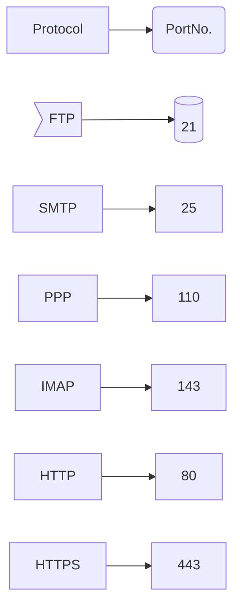

## TCP vs UDP

|                                       | TCP                 | UDP                                                    |
| ------------------------------------- | ------------------- | ------------------------------------------------------ |
| **Connection**                  | Connection Oriented | Connectionless                                         |
| **Reliability**                 | Reliable            | Unreliable                                             |
| **Data Transmission speed**     | Slow                | Fast                                                   |
| **Header Size**                 | 20 bytes            | 8 bytes                                                |
| **Packet Size**                 | 65,535 bytes        | 65,535 bytes                                           |
| **Bandwidth Usage**             | Less                | More                                                   |
| **Used in**                     | Web, Email, FTP     | Video Streaming, Video Conferencing, Online Gaming,DNS |
| **Connection Establishment**    | Yes                 | No                                                     |
| **Retransmission Of Lost Data** | Yes                 | No                                                     |
| **Error Checking**              | Yes                 | No                                                     |
| **Flow Control**                | Yes                 | No                                                     |
| **Congestion Control**          | Yes                 | No                                                     |
| **Sequencing**                  | Yes                 | No                                                     |
| **ACK**                         | Yes                 | No                                                     |
| **Handshake**                   | Yes                 | No                                                     |
|                                       |                     |                                                        |
# Data Transmission Modes

- Data Transfer between two devices over network.
- also known as mode of Communication
- **Types**
  - **Simplex**
    - Uni Directional
    - Data can only be sent in one direction
    - loudspeaker ,monitor, keyboard etc
  - **Half Duplex**
    - Bi Directional
    - But only one action can be taken at a time
    - Walkie Talkie
  - **FULL DUPLEX**
    - Bi directional
    - Receiving and sending at same instance
    - Telephone network

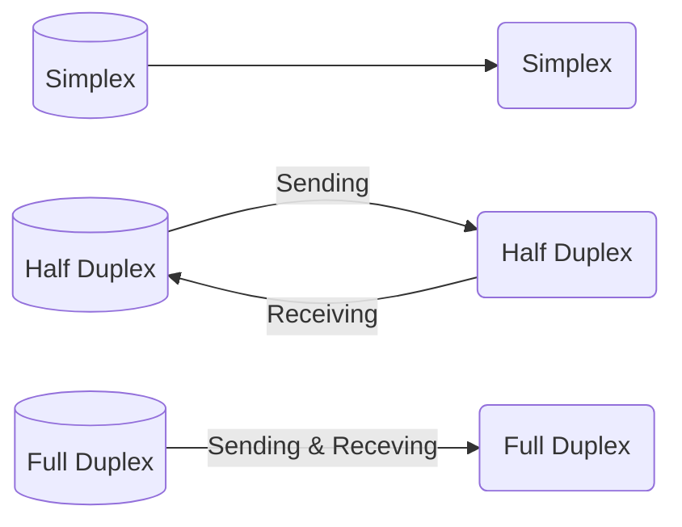

# Data Transmission

- process of transferring data b/w two or more digital devices in analog or digital form
- **Types**
  - **Serial**
    - One bit at a time
    - Slow
    - Long Distance
    - Types
      - Synchronous
        - A lot of data sent in a block
      - Asynchronous
        - only one character is sent at a time
        - Uses start and stop bits for transferring data
    - Ex: Keyboard, Mouse
  - **Parallel**
    - Multiple bits at a time
    - Fast
    - Short Distance
    - Ex: Printer, Scanner

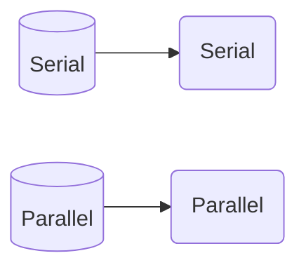

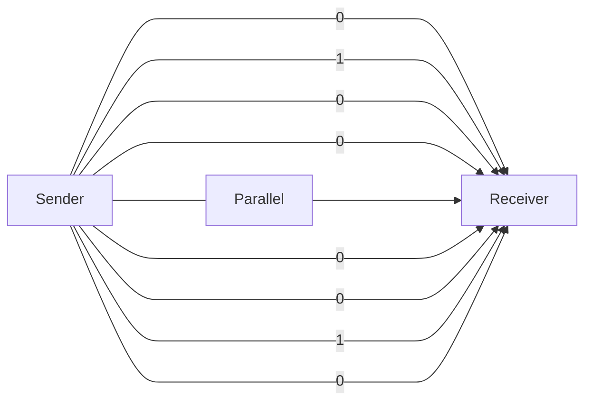

```mermaid
graph LR;
A[Sender]--0--1--0--1--1-->B[Receiver]
A--Series-->B
```

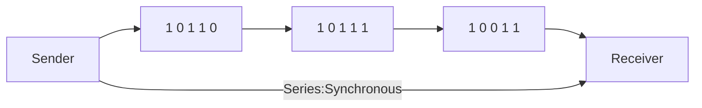

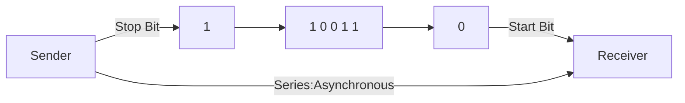

# Data Communication

- Process of sending and receiving digital data b/w two or more computers via transmission medium such as wire cable
- 5 Components of Data Communication
  - Message
  - Sender
  - Receiver
  - Transmossion Medium
  - Protocol

# IP Address

- Internet Protocol Address
- unique number provided to each and every address
- form of integric number separated by dots
- 192.168.10.26

  ```mermaid
  graph TB;
  A[Address]-->B[IP Address <br/> Logical]
  A-->C[MAC Address <br/> Physical]
  subgraph IP Types;
  IP-->X[IPV4 <br> - length 32 bits <br> - Octet -4 <br> - 0 to 255<br> - 4 billlion<br> - 192.168.10.26]
  IP-->Y[IPV6<br> - length 128 bits<br> - Octet 8<br> - 0 to FFFF<br> - 340 Trillion<br> - 2001:0db8:85a3:0000:0000:8a2e:0370:7334]
  end
  ```
- IPV6 & IPV4

  - FFFF:65535
  - 4 billion-> $2^{3 \\ 2}$
  - 340 trillion -> $2^{1\\2\\8}$
  - Uses of IP
    - PUBLIC
    - PRIVATE
- Classes of IP

  - Class A: 0 to 126 (127 reserved):125.255.23.17
  - Class B: 128 to 191: 191.23.34.123
  - Class C: 192 to 223:192.204.10.14
  - Class D: 224 to 239:used for multicasting
  - Class E: 240 to 255:reserved for research
- Network ID : 1
- Host ID: 0
- OCTET

  ```mermaid
  graph LR;
  subgraph 1:8
  end
  subgraph 2:8
  end
  subgraph 3:8
  end
  subgraph 4:8
  end
  1:8-->2:8-->3:8-->4:8
  A[Each Octet has 8 bits]
  B[Each Octet has 8 bits]
  ```
- Class A

  ```mermaid
  graph TB;
  subgraph A[H]
  end
  subgraph B[H]
  end
  subgraph H
  end
  subgraph N
  end
  ```
- Class B

  ```mermaid
  graph TB;
  subgraph A[H]
  end
  subgraph B[H]
  end
  subgraph C[N]
  end
  subgraph D[N]
  end
  ```
- Class C

  ```mermaid
    graph TB;
    subgraph A[H]
    end
    subgraph B[H]
    end
    subgraph C[H]
    end
    subgraph D[N]
    end
  ```

## Difference Between IPV4 & IPV6

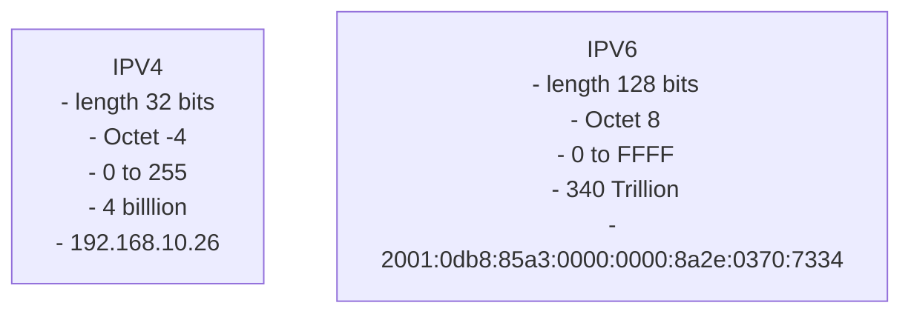

# Mac Address

- Media Access Control
- physical address
- hardware address
- unique and permanent for all n/w devices
- **FORMAT**
  - MM:MM:MM:SS:SS:SS
  - MM-MM-MM-SS-SS-SS
  - MMM.MMM.SSS.SSS
- Start 6: manufacturer
- End 6:NIC number
- USES
  - DEVICE tracking
  - Private communication

# Difference b/w IP & MAC
| IP | MAC |
| --- | --- |
| Logical | Physical |
| Network Layer | Data Link Layer |
| Software | Hardware |
| Assigned by ISP | Assigned by Manufacturer |
| Can be changed | Can be changed only changing LAN card|
| 32 bits/128 bits | 48 bits |
| identifies network | identifies device |
# Server

- main computer in a network that provides services to other computers
- provides services like

  - file storage
  - email
  - web pages
  - database
  - etc
- **Types**

  - **File Server**
    - stores and manages files
    - Ex: Google Drive
  - **Print Server**
    - manages one or more printers
    - Ex: Google Cloud Print
  - **Database Server**
    - stores and manages database
    - Ex: MySQL
  - **Web Server**
    - stores and manages web pages
    - Ex: Apache
  - **Mail Server**
    - stores and manages emails
    - Ex: Gmail
  - **FTP Server**
    - stores and manages files for downloading and uploading
    - Ex: FileZilla
  - **Proxy Server**
    - acts as an intermediary b/w client and server
    - Ex: Squid
  - **DHCP Server**
    - assigns IP addresses to computers
    - Ex: DHCP Server
  - **DNS Server**
    - translates domain names to IP addresses
    - Ex: Google DNS
  - **Telnet Server**
    - allows remote login to a computer
    - Ex: Telnet
  - **Application Server**
    - provides business logic to application programs
    - Ex: Apache Tomcat
  - **Virtual Server**
    - allows multiple servers to run on a single physical server
    - Ex: VirtualBox
  - **Backup Server**
    - stores and manages backup files
    - Ex: BackupPC
  - **Fax Server**
    - manages fax machines
    - Ex: HylaFAX
  - **Groupware Server**
    - provides collaboration services
    - Ex: Microsoft Exchange Server
  - **IRC Server**
    - manages Internet Relay Chat
    - Ex: IRC Server
  - **List Server**
    - manages mailing lists
    - Ex: Mailman
  - **News Server**
    - manages Usenet news groups
    - Ex: Leafnode
  - **Open Source Server**
    - manages open source software
    - Ex: SourceForge
  - **Sound Server**
    - manages sound devices
    - Ex: PulseAudio
  - **Time Server**
    - manages time synchronization
    - Ex: NTP
  - **VPN Server**
    - manages virtual private networks
    - Ex: OpenVPN
  - **Web Proxy Server**
    - manages web proxy
    - Ex: Squid
  - **Windows Server**
    - manages Windows computers

# Internet

- Network of networks that connects billions of computers worldwide
- **History**
  - 1960s
    - US Department of Defense (DoD) created ARPANET
    - ARPANET was the first network to use packet switching
    - ARPANET was the first network to use TCP/IP
  - 1970s
    - ARPANET was split into ARPANET and MILNET
    - ARPANET was used for research and MILNET was used for military
    - ARPANET was the first network to use email
  - 1980s
    - ARPANET was split into ARPANET and NSFNET
    - ARPANET was used for research and NSFNET was used for non-military research
    - ARPANET was the first network to use TCP/IP
  - 1990s
    - ARPANET was shut down
    - NSFNET was shut down
    - NSFNET was the first network to use 56 Kbps speed
  - 2000s
    - ARPANET was shut down
    - NSFNET was shut down
    - NSFNET was the first network to use 1.5 Mbps speed
  - 2010s
    - ARPANET was shut down
    - NSFNET was shut down
    - NSFNET was the first network to use 10 Gbps speed

# DNS

- DNS :Domain Name Service
- Domain Name Server
- automatic service that converts domain name to its corressponding ip addressso that web browser can understand ehich browser we we want to access
- **Types**
  - **Root Name Server**
    - manages top-level domains
    - Ex: a.root-servers.net
  - **Top-Level Domain Name Server**
    - manages top-level domains
    - Ex: .com
  - **Authoritative Name Server**
    - manages domain names
    - Ex: google.com
  - **Local Name Server**
    - manages local domain names
    - Ex:
  - **Forwarding Name Server**
    - forwards requests to other name servers
    - Ex:

# ISP

- Internet Service Provider
- provides internet access to customers
- **Types**
  - **Dial-up**
    - uses telephone line
    - Ex: BSNL
  - **DSL**
    - uses telephone line
    - Ex: Airtel
  - **Cable**
    - uses cable TV line
    - Ex: Hathway
  - **Satellite**
    - uses satellite
    - Ex: Tata Sky
  - **Wireless**
    - uses wireless
    - Ex: Jio
  - **Mobile**
    - uses mobile network
    - Ex: Airtel
  - **Fiber**
    - uses fiber optic cable
    - Ex: ACT
  - Types
    - **Tier 1 ISP**
      - connects to the internet backbone
      - All over the world
      - Ex: AT&T
    - **Tier 2 ISP**
      - In a country
      - Ex: Airtel
    - **Tier 3 ISP**
      - In a City
      - Ex: MTNL

# Difference B/W Internet & Intranet
| Internet | Intranet |
| --- | --- |
| Public Network | Private Network |
| Accessible to everyone | Accessible to only employees |
| Uses Internet Protocol | Uses Internet Protocol |
|  |JIO,AIRTEL,BSNL, IIT BHU Ka Wifi ,Mere ghar ka Mexon Wifi|
# Network Architecture

- Network Layer Which tells us how compters are arranged and how tasks are allocated to computers
- Types of Network Architecture
  - Peer to Peer architecture
  - Client Server Architecture

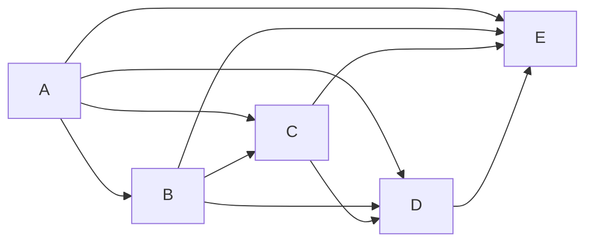

- Advantages of Peer to Peer Architecture
  - Cheaper because it hasn't any server
  - setup easy
  - maintainance easy
  - single failure don't disturb all
- Disadvantages of Peer to Peer Architecture
  - Security Issue
  - Can't take the backup of data
  - Server is not present so above two are problems
- **Client Server Architecture**
  - Server is present
  - Server is used to store data
  - Server is used to take backup of data
  - Server is used to provide security
  - Server is used to provide services
  - Server is used to provide resources
  - Server is used to provide applications
  - Server is used to provide storage
  - Server is used to provide processing
  - Server is used to provide communication
  - Server is used to provide printing
  - Server is used to provide database
  - Server is used to provide web
  - Server is used to provide mail
  - Server is used to provide file
  - Server is used to provide proxy
  - Server is used to provide ftp
  - Server is used to provide dns
  - Server is used to provide dhcp
  - Server is used to provide ntp
  - Server is used to provide ldap
  - Server is used to provide vpn
  - Server is used to provide voip
  - Server is used to provide web
  - Server is used to provide mail
  - Server is used to provide file
  - Server is used to provide proxy
  - Server is used to provide ftp
  - Server is used to provide dns
  - Server is used to provide dhcp
  - Server is used to provide ntp
  - Server is used to provide ldap
  - Server is used to provide vpn
  - Server is used to provide voip
  - Server is used to provide web
  - Server is used to provide mail
  - Server is used to provide file
  - Server is used to provide proxy
  - Server is used to provide ftp
  - Server is used to provide dns
  - Server is used to provide dhcp
  - Server is used to provide ntp
  - Server is used to provide ldap
  - Server is used to provide vpn
  - Server is used to provide voip
  - Server is used to provide web
  - Server is used to provide mail
  - Server is used to provide file
  - Server is used to provide proxy
  - Server is used to provide ftp
  - Server is used to provide dns
  - Server is used to provide dhcp
  - Server is used to provide ntp
  - Server is used to provide ldap
  - Server is used to provide

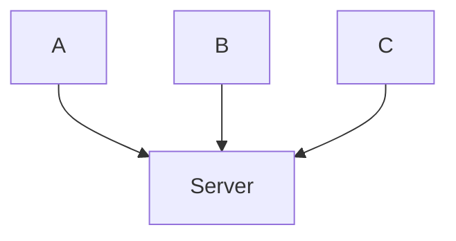

- Advantage of Client Server Architecture
  - centrallised system through which back up can easily be done
  - better security
  - entire system maintained by server
  - also increase the speed of resource sharing
- Disadvantages of Client Server Architecture
  - Server failure cause unaccessibilty of the resource
  - expensive (ec2,lambda)

# Guided And Unguided Media
| Guided Media | Unguided Media |
| ------------ | -------------- |
| Twisted Pair | Radio          |
| Coaxial      | Microwave      |
| Optical      | Satellite      |
|              | Infrared       |
|Speed: 10Mbps to 10Gbps|Speed: 1Mbps to 2Mbps|
|Distance: 100m to 2km|Distance: 2km to 100km|
|Cost: Low|Cost: High|
|Installation: Easy|Installation: Difficult|
## OSI MODEL

**Open System Interconnection**

- This is a reference model
- 1970's & 80's
- reference model for TCP/IP model
- Protocols & Layered System

  - set up of some rules
- Let us understand Layered system via diagram

  ```mermaid
  graph LR;
  A[Location A] --> B[Location B]
  ```

  - Seven Layers of OSI Model

    ```mermaid
    graph LR;
    A[Application Layer]
    B[Presentation Layer]
    C[Session Layer]
    D[Transport Layer]
    E[Network Layer]
    F[Data Link Layer]
    G[Physical Layer]
    ```

    - (Technique): All People Seems To Need Data Processing

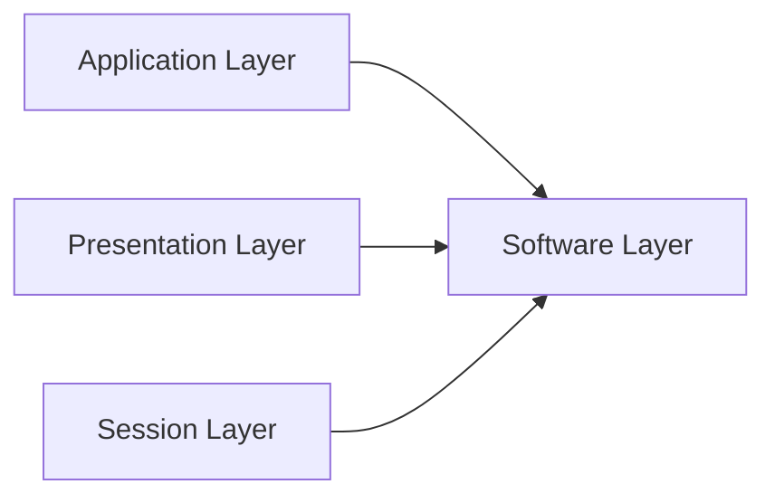

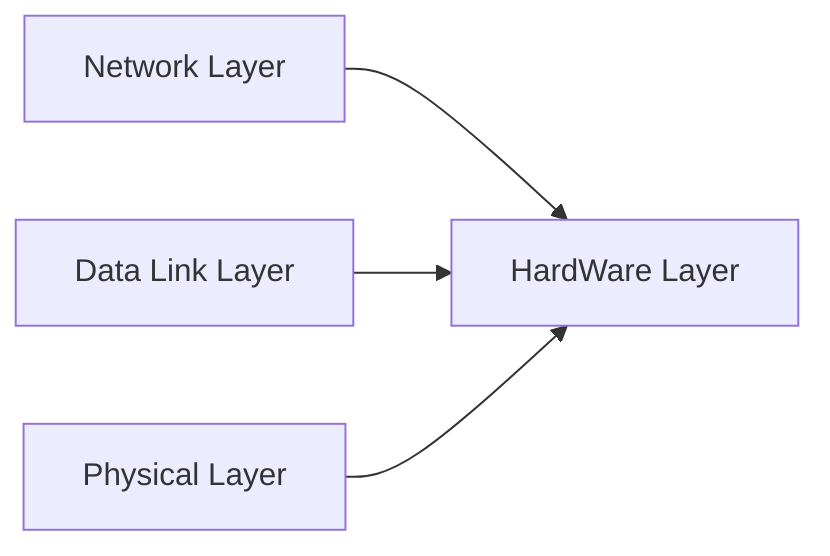

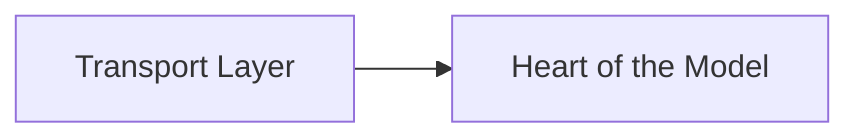

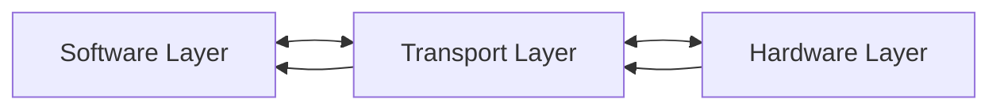

- Application Layer
  - Provide User Interface Like Safari ,Chrome ,Brave
  - Provide Different Protocols for sharing the data
  - Ex: HTTP,FTP,SMTP
  - HTTP: Hyper Text Transfer Protocol(Website viewing)
  - FTP:File Transfer Protcol
  - SMTP:Simple Mail Transfer Protocol
  - HTTPS:Hyper Text Transfer Protocol Secure

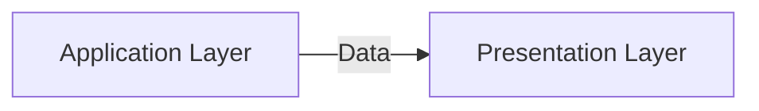

- Presenatation Layer

  - Reformat the received data(Converting to ASCII Character)
  - Data Encrypting (AAA-->$#@@)(To save from hacking)
  - Data Compression(File size reduction)(less time more data transfer)
- Session Layer

  - Create and Manage Session(Create Session for sender and Receiver will ready to authenticate and receive)
  - Add Check points (If connection interrupted then resending data from resumed point )
  - Terminate Session

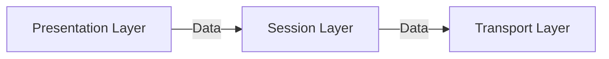

- **- - >Transport Layer**
- If we are using whatsapp and youtube at same time how the system will identify which data is coming from which source so this is done by Transport Layer
- Transport Layer uses port number and ip address to identify data source and by this bits data is differentiated
- Threre is total 65,536 port numbers

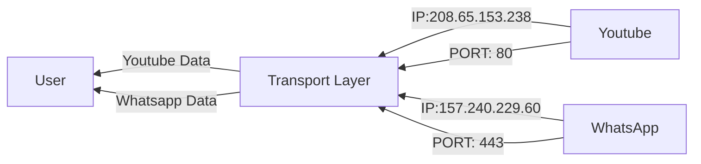

- Transport Lyer also decides which Connection type should be used to transport data
- TCP/UDP
  - If data will be transferred by TCP then this will be connection oriented protocol
  - TCP is connection oriented
  - UDP is connection less
  - In connection oriented model first connection is established then communication starts
  - In connection less model no conection is established just messages are sent

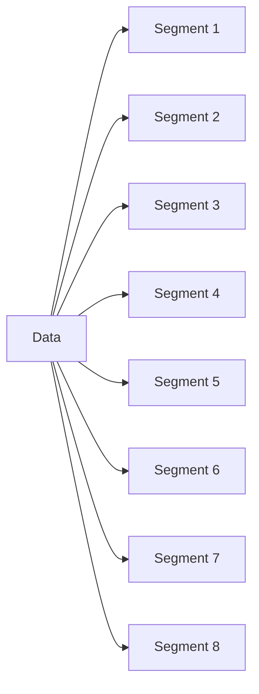

- Transport layer divides data in to segments
- Convert data to segments
- Flow Control
- Error Control
- **Network Layer**

  - Segments to packets

    - Each Packet go through different network before reaching the destination
    - Network Layer selects the quickest path for a packet to reach destination
    - Routers help the network layer in finding the best path
    - Network layer uses ip address to transfer a packet
    - once the ip address is assigned it will not change

    ```mermaid
    graph LR;
    D[Segment]-->A[Packet 1]
    D-->B[Packet 2]
    D-->C[Packet 3]
    D-->E[Packet 4]
    D-->F[Packet 5]
    D-->G[Packet 6]
    D-->H[Packet 7]
    D-->I[Packet 8]
    ```
- **Data Link Layer**

  - Packets to frames
  - how many frames that will be totally dependent on hardware used in data link layer
  - Mostly Hardware in data link layer is Network Interface Card(NIC)
  - NIC:
    - In which lan is connected
    - Swich and hub also work in this layer
  - In this layer to transfer the data we use MAC Address
  - And data is transferred system to system
  - Media Access Controller Layer
    - Desices which system will receive the media
- **Physical Layer**

  - Decides how raw bits will be transferred through physical medium
  - If Physical Medium are wires then Electric Signal will be used to transmit data
  - If Wireless like wifi then radio signals will be used to transfer data
  - Physical Layer also decides the representation signal for 1 and 0 in a communication medium
  - Lifetime of a bt is also decided
  - Data rate also decided in this layer
  - also check mode of communication (simplex,half duplex,full duplex)

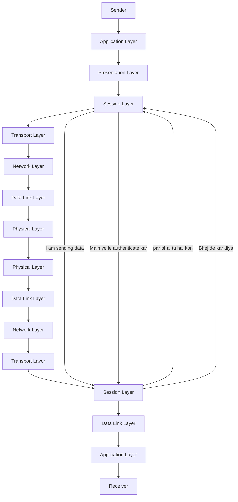

## TCP/IP Model

- Follows two protocols
- TCP:Transmission Control Protocol
- IP:Interenet Protocol
- Concern of that time we were able to comunicate Dell to Dell laptop
  ```mermaid

  ```

